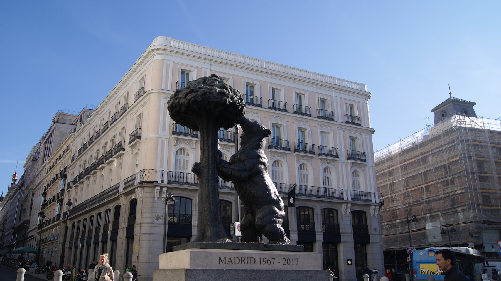
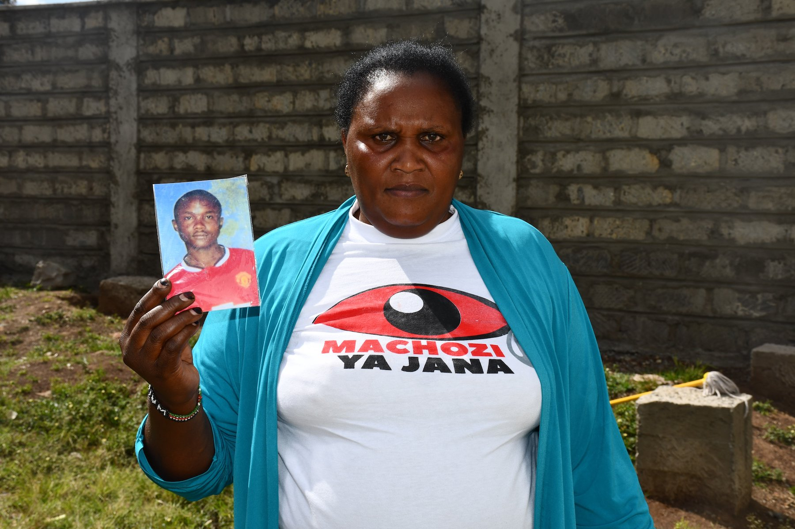
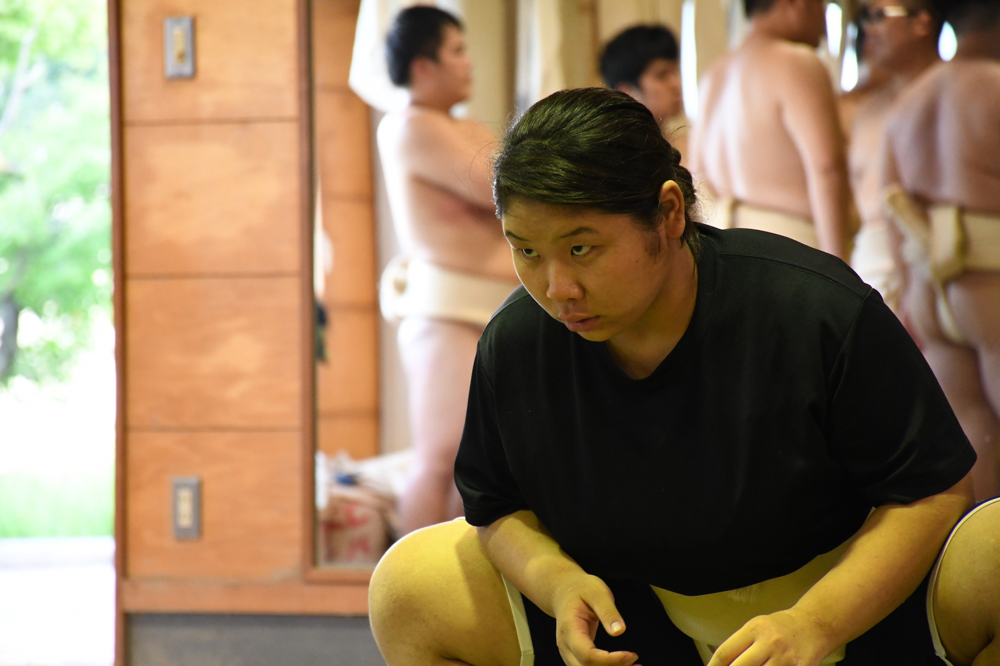
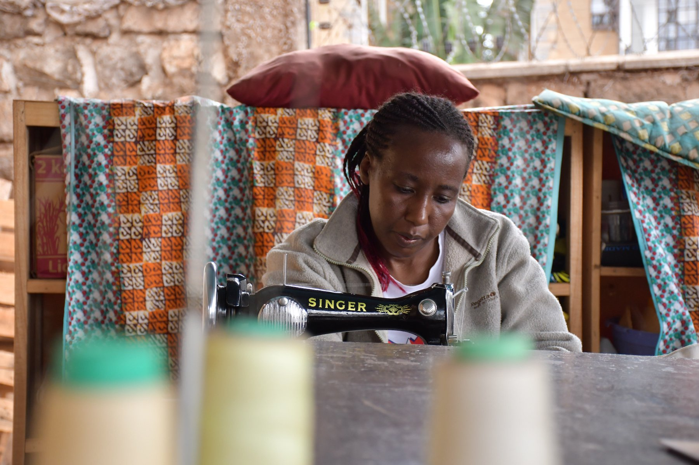
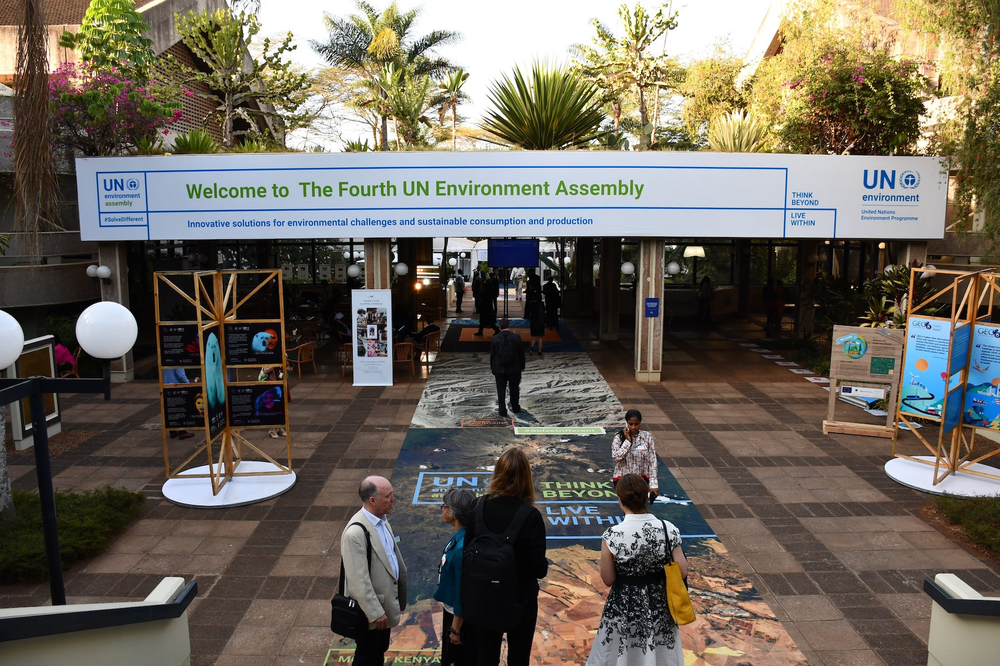
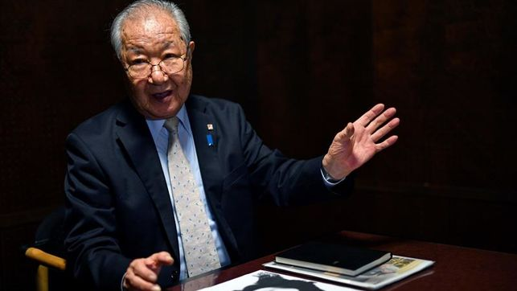

# English

## [Monumental bias: Madrid puts up four statues of a man for every statue of a woman](https://towardsdatascience.com/monumental-bias-madrid-puts-up-four-statues-of-a-man-for-every-statue-of-a-woman-1e978030b633)

### Since 1600, the city has erected 298 statues, of which 49 are dedicated to women. Of these, only a small percentage depict female historical figures.

 ‘The Bear and the Strawberry Tree’, Madrid’s most famous statue | Photo: Edurne Morillo 

##### Published in: Towards Data Science

## [Kenya fights to bring back its ‘Missing Voices’ snatched by police violence](https://medium.com/@edurne.morillo/kenya-fights-to-bring-back-its-missing-voices-snatched-by-police-violence-cc067cf2b1f1)

### Extrajudicial killings and forced disappearances are still a non-spoken problem in Kenya, where families fear reprisals if they go to court.

 Milikah Kamande, whose son was killed in April 2017 | Photo: Edurne Morillo 

##### Published in: EFE News Agency, Medium and distributed in several international media worldwide

##### Click [here](https://www.lavanguardia.com/politica/20190220/46595240157/kenia-lucha-por-recuperar-sus-voces-perdidas-por-la-violencia-policial.html) for the Spanish version of this article

## [Japanese women wrestlers struggle to find place in professional Sumo](https://www.efe.com/efe/english/sports/japanese-women-wrestlers-struggle-to-find-place-in-professional-sumo/50000266-3694636#)

### Sumo, an age-old symbol of Japanese culture, has over the past few years been rocked by scandals, including the exclusion of women, a fact that thousands of amateurs seek to change.

 The Sumo Club at Asahi University in Gifu (Japan) | Photo: Fabien Salathe 

##### Published in: EFE News Agency and distributed in several international media worldwide

##### Click [here](https://www.france24.com/es/20180718-japon-sumo-mujeres-escandalos-discriminacion) for the Spanish version of this article

## [Thread and needle, the survival tools for Kenyan women](https://www.efe.com/efe/english/destacada/thread-and-needle-the-survival-tools-for-kenyan-women/50000261-3949121)

### A Kenyan mother-of-five has described how sewing has helped her family survive.

 Mrembo Africa in Kangemi slums | Photo: Edurne Morillo

##### Published in: EFE News Agency and distributed in several international media worldwide

##### Click [here]() for the Spanish version of this article

# Spanish

## [La ONU acuerda reforzar la lucha mundial contra las amenazas al medioambiente](https://www.efe.com/efe/america/sociedad/la-onu-acuerda-reforzar-lucha-mundial-contra-las-amenazas-al-medioambiente/20000013-3926095)

### La Asamblea de Medio Ambiente de la ONU (UNEA-4) aprobó hoy en Nairobi una declaración ministerial para "aumentar" los esfuerzos y atajar "desafíos medioambientales comunes".

 UNEA4 in Nairobi | Photo: Edurne Morillo 

##### Published in: EFE News Agency and distributed in several international media worldwide

## [La herida abierta de los japoneses secuestrados por Corea del Norte](https://www.eldiario.es/politica/abierta-japoneses-secuestrados-Corea-Norte_0_718478309.html)

### Una niña que nunca volvió a casa después del colegio y una madre soltera que jamás recogió a sus hijos de la guardería: dos historias de secuestros perpetrados por Corea del Norte hace ya 40 años.

 Hermano de Yaeko Taguchi, secuestrada en 1978 | Photo: Franck Robichon (EPA) 

##### Published in: EFE News Agency and distributed in several international media worldwide
